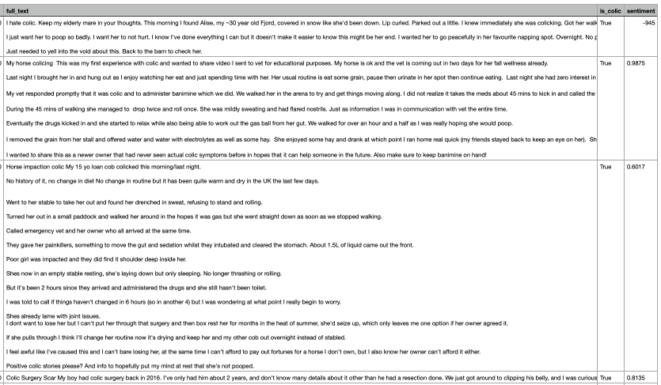

# 🐴 Equine Colic Risk Factors - Python Edition

**Pure Python pipeline to analyze horse colic discussions from Reddit.**

## 🚀 Quick Start
```bash
# Installation
pip install -r requirements.txt

# Datenbereinigung
python src/preprocessing/clean_text.py --input data/raw/reddit_posts.csv

# Sentiment-Analyse
python src/analysis/sentiment.py --data data/processed/cleaned.csv
```

## 📂 Project Structure
| Ordner          | Inhalt                                     |
|-----------------|--------------------------------------------|
| `src/`          | Hauptcode (modular, getestet)              |
| `data/processed`| Bereinigte Daten mit Sentiment-Labels      |
| `outputs/plots` | Automatisch generierte Visualisierungen    |

## 🔍 Kernfunktionen
1. **Keywords anpassen**
Bearbeite `data/keywords/colic_keywords.txt`:
- Ein Begriff pro Zeile
- Kommentare mit `#` ignorieren

2. **Keyword-Filterung**  
   - Identifiziere Kolik-relevante Posts mit veterinärmedizinischen Begriffen.
   ```python
   from src.preprocessing.filter_keywords import is_colic_related
   df["is_colic"] = df["text"].apply(is_colic_related)
   ```

3. **Sentiment-Analyse**  
   - Nutzt angepasstes VADER-Lexikon für Pferdebesitzer-Jargon.
   ```python
   from src.analysis.sentiment import analyze_sentiment
   df["sentiment"] = df["text"].apply(analyze_sentiment)
   ```

4. **Kommandozeilen-Tools**  
   - Skripte laufen mit `--help` für Parameter-Dokumentation:
   ```bash
   python src/visualization/plot_sentiment.py --help
   ```

## 📊 Beispiel-Output


## 🧠 Word Embeddings (SkipGram)
   Zusätzlich zur Sentiment-Analyse enthält das Projekt ein SkipGram-Neuronales Netz, das Wort-Embeddings für Kolik- und Wetterdiskussionen aus Reddit generiert.

### Features
   - SkipGram mit **Negative Sampling**  
   - Optimizer: **Adam**, Embedding-Dimension: **100**  
   - Kontextpaare basierend auf Keywords aus `data/keywords/`  
   - Beispielausgabe: Embedding für das Wort *rain*  

### Ausführung
 ```bash
   # Training starten
   python src/models/skipgram_nn.py
   ```

### Beispielausgabe
```text
Anzahl Skipgram-Pairs: 13666
Epoch 1/10, Loss: ...
...
Embedding für 'rain': [[0.25, 1.13, ...]]
```

### Ziel
Die erzeugten Embeddings helfen, Zusammenhänge zwischen Kolik-Risikofaktoren und Wetterbedingungen in Textdiskussionen zu erkennen.

## 🛠 Dev Tools
- **Logging**: Zentral in `src/utils/logger.py`  
- **Testing**: Pytest für alle Module (`tests/`)  
- **CI/CD**: GitHub Actions für automatisiertes Testing  

## 🤝 Mitwirken
- **Issues**: Melde fehlende Schlüsselwörter in `data/keywords/`  
- **Datenlabeling**: Hilf beim Erweitern der Sentiment-Labels (`docs/labeling_guide.md`)